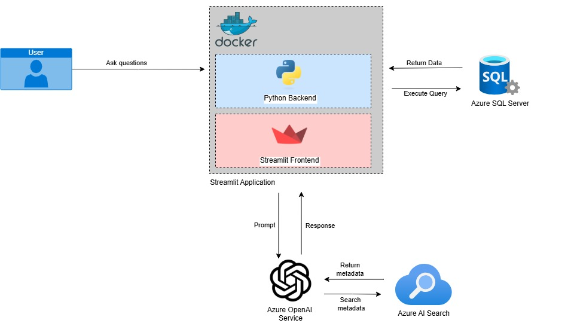
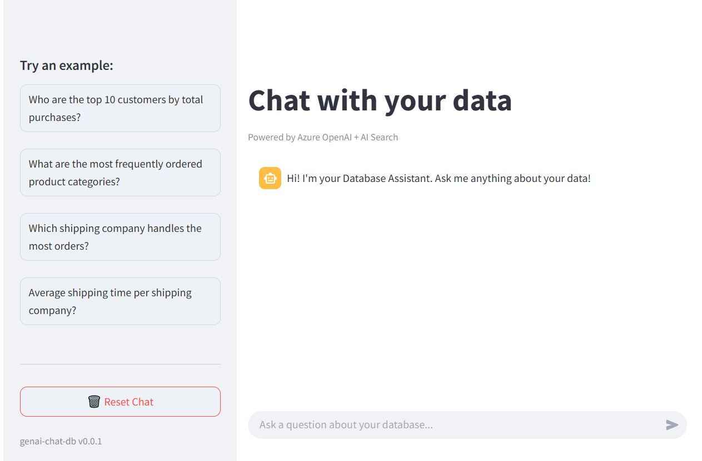
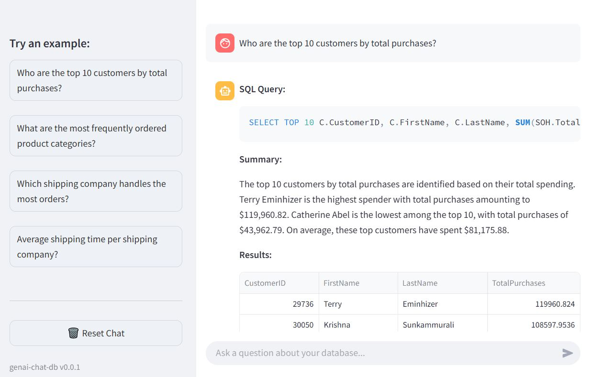

# Building a Chat with a Database using Generative AI
This solution leverages Generative AI to enable non-technical users to interact with a structured database through natural language. It uses Azure OpenAI Service with the GPT-4o model to convert user questions into SQL queries, and Azure AI Search to provide additional context through data indexing and retrieval. The system connects to a sample dataset hosted in an Azure SQL Database, allowing users to ask questions about orders, products, and customers without needing knowledge of SQL.

This solution's backend is written in Python.

## Table of Contents
1. [Architecture Overview](#architecture-overview)
2. [Architecture Diagram](#architecture-diagram)
3. [Approach](#approach)
4. [Security Guardrails](#security-guardrails)
5. [Sample Demonstration](#sample-demonstration)
6. [Getting Started](#getting-started)
   - [Prerequisites](#prerequisites)
   - [Installation Options](#installation-options)
     - [Option 1: Run locally with Conda](#option-1-run-locally-with-conda)
     - [Option 2: Run with Docker](#option-2-run-with-docker)
7. [Deployment (Optional)](#deployment-optional)

##  Architecture Overview
- **Frontend:** Streamlit
- **Backend:** Python (using modular imports)
- **AI Models:** Azure OpenAI
- **Search Service:** Azure AI Search
- **Database:** Azure SQL Database

### [Optional] For Deployment
- **Container Registry**: Azure Container Registry (ACR)
- **App Hosting**: Azure Container Apps
- **CI/CD Pipeline**: Uses GitHub Actions to build, retag, and push Docker images to Azure Container Registry (ACR), and deploy them to Azure Container Apps.

## Architecture Diagram


## Approach
The solution follows a Retrieval-Augmented Generation (RAG) approach to enable natural language interaction with a structured database:
- **Azure SQL Database** is used to host the in-house sample dataset.
- Two indexes were created in **Azure AI Search** to store database metadata:
  - The first index contains metadata such as table names, column names, data types, and sample values. This data is extracted from `INFORMATION_SCHEMA.TABLES` and `INFORMATION_SCHEMA.COLUMNS`.
  - The second index stores relationship data, specifically foreign key relationships between tables.
- **Azure OpenAI Service** is used with the RAG approach to interpret user queries. The system determines which tables are relevant based on the user's question. It then queries Azure Search to retrieve related metadata and relationships, which are provided to the GPT-4o model as context (e.g., "You have these tables, columns, and relationships"). Based on this context, the model generates an appropriate SQL query to answer the user's question. The generated SQL is executed against the Azure SQL Database to retrieve the relevant data. To avoid passing large volumes of data into the language model (which could exceed token limits), the system summarises the data first (e.g., generating statistical summaries). These statistical summaries are then sent to the GPT-4o model for interpretation. The final response includes the original user query, relevant data, and natural language explanations of the data.

### Security Guardrails
There are database security measures in place to protect data integrity and ensure safe usage:
- **Only SELECT statements are allowed.** Any attempt to execute modifying commands such as DELETE, UPDATE, or DROP is explicitly blocked.
- **SQL injection prevention:** Malicious query patterns-even within SELECT statements-such as UNION SELECT, tautologies like WHERE 1=1, or other suspicious constructs used for table dumping are detected and rejected.
- **Sensitive data masking** is applied to hide confidential information such as phone, emails, and private fields.

## Sample Demonstration
### User Question:
Who are the top 10 customers by total purchases?

### Application Workflow:
**1. Identifies relevant tables:**

The Azure OpenAI model (GPT-4o) detects that the question involves the `Customer` and `SalesOrderHeader` tables.

**2. Retrieves metadata and relationships:**

Azure AI Search is used to fetch table metadata and foreign key relationships.

**3. Generates SQL query using Azure OpenAI (GPT-4o):**

A prompt is created with the relevant schema and sent to the Azure OpenAI model to generate the SQL query.

**4. SQL query generated:**

```sql
SELECT TOP 10 C.CustomerID, C.FirstName, C.LastName, SUM(SOH.TotalDue) AS TotalPurchases 
FROM SalesLT.Customer C 
JOIN SalesLT.SalesOrderHeader SOH ON C.CustomerID = SOH.CustomerID 
GROUP BY C.CustomerID, C.FirstName, C.LastName 
ORDER BY TotalPurchases DESC
```

**5. Executes the SQL query:**

The generated SQL is validated to ensure it is safe (read-only), then executed against the Azure SQL Database.

**6. Returns the data:**

The results are returned as a table which can be downloaded as a `.csv` file.

**7. Returns a summary:**

The Azure OpenAI model (GPT-4o) then summarises and interprets the results retrieved.

Summary:
```
The top 10 customers by total purchases are identified based on their total spending.
Terry Eminhizer is the highest spender with total purchases amounting to $119,960.82.
Catherine Abel is the lowest among the top 10, with total purchases of $43,962.79.
On average, these top customers have spent $81,175.88.
```

### Screenshot



### Demo Video
[Here's a video demo of the app.](https://youtu.be/PNldPoSFjAA)


## Getting Started
### Prerequisites
Before you begin, make sure the following are installed and set up:
- **Anaconda** or **Miniconda**  (for local environment setup)
  - Install Anaconda by following the instructions [here](https://www.anaconda.com/docs/getting-started/anaconda/install#anaconda-website).
  - Alternatively, install Miniconda (a lightweight version of Conda) from [here](https://www.anaconda.com/docs/getting-started/miniconda/install).
- **Docker** (for running the app in a container)
  - **Windows/macOS:** Install Docker Desktop from [here](https://www.docker.com/products/docker-desktop/)
  - **Linux:** Install Docker Engine using the instructions [here](https://docs.docker.com/engine/install/)
- An **Azure subscription** with access to:
  - Azure OpenAI Service
  - Azure AI Search
  - Azure SQL Database
  - [Optional] Azure Container Registry (ACR)
  - [Optional] Azure Container App

  Refer to the [documentation](./docs) for guidance on setting up these services.

  > Note: To reduce costs, consider using free tiers or Azure Free Credits.

### Installation Options
You can choose to run the application locally using either Conda or Docker:

#### Option 1: Run locally with Conda

**1. Clone the repository**

```sh
git clone https://github.com/crushedmonster/genai-chat-db.git
cd genai-chat-db
```

**2. Create and activate the Conda environment**

A `conda-env.yaml` file is provided to simplify environment setup.

```sh
conda env create -f conda-env.yaml
conda activate genai-chat-db
```

**3. Configure Environment Variables**

Create a `.env` file in the project root by copying the provided [`.example.env`](.example.env) file.

Fill in your actual Azure service credentials and endpoints.


**4. Run the Application**
From the project root, launch the app using Streamlit:

```sh
streamlit run src/app.py
```

The app will open in your browser at: `http://localhost:8051`

#### Option 2: Run with Docker

**1. Build the Docker image:**

From the project root directory (where the Dockerfile is located), run:

```sh
docker build -t genai-chat-db .
```

**2. Run the container (using your environment file):**

```sh
docker run --env-file "/path/to/.env" -p 8501:8501 genai-chat-db
```
> Note: Make sure to replace "/path/to/.env" with the full path to your .env file.
> The .env file should contain your Azure service credentials and endpoints, and match the format in [`.example.env`](.example.env).

The application will be available at: `http://localhost:8501`

### Deployment (Optional)

You can deploy the application to **Azure Container Apps** using **GitHub Actions** and **Docker**, with the docker image hosted in **Azure Container Registry (ACR)**.

**1. Overview**

This project includes a GitHub Actions workflow that:

- Builds a Docker image from the project
- Pushes the image to Azure Container Registry (ACR)
- Deploys it to Azure Container Apps

**2. Prerequisites**

Before running the workflow, ensure you have the following resources created in Azure:

- Azure Container Registry (ACR)
- Azure Container App

You also need a **Service Principal** with contributor access to your Container App.

In your GitHub repository, go to:
**Settings > Secrets and variables > Actions**  

Add the following:

#### Repository Secrets

| Secret Name            | Description                               |
|------------------------|-------------------------------------------|
| `ACR_USERNAME`         | Azure Container Registry username         |
| `ACR_PASSWORD`         | Azure Container Registry password         |
| `AZURE_CLIENT_ID`      | Azure Service Principal client ID         |
| `AZURE_CLIENT_SECRET`  | Azure Service Principal client secret     |

####  Repository Variables

| Variable Name              | Description                                              |
|---------------------------|----------------------------------------------------------|
| `ACR_LOGIN_SERVER`         | Login server of your ACR (e.g., `myregistry.azurecr.io`) |
| `AZURE_TENANT_ID`          | Azure tenant ID                                          |
| `AZURE_SUBSCRIPTION_ID`    | Azure subscription ID                                    |
| `AZURE_RESOURCE_GROUP`     | Azure resource group where your infrastructure is hosted |
| `AZURE_CONTAINERAPP_NAME`  | Name of your Azure Container App                         |


**3. Configure Environment Variables in Azure Container Apps**

Instead of using a `.env` file, each variable required by the application can be manually configured in the **Azure Container App** under:

**Azure Portal > Your Container App > Settings > Application > Containers > Environment Variables**

Define the following environment variables:

#### Azure SQL Database Configuration

| Variable      | Description                                   |
|---------------|-----------------------------------------------|
| `SQL_SERVER`  | The host of your Azure SQL Server             |
| `SQL_DATABASE`| The name of your Azure SQL database           |
| `SQL_USERNAME`| The username used to authenticate (read-only access) |
| `SQL_PASSWORD`| The password used for SQL authentication      |
| `SQL_PORT`    | SQL Server port (default: `1433`)             |

#### Azure OpenAI Configuration

| Variable                          | Description                                                                  |
|-----------------------------------|------------------------------------------------------------------------------|
| `AZURE_OPENAI_ENDPOINT`           | Azure OpenAI resource endpoint (from Azure Portal)                           |
| `AZURE_OPENAI_KEY`                | Azure OpenAI API key                                                         |
| `AZURE_DEPLOYMENT_MODEL`          | Name of the deployed model (e.g., `gpt-4o`, `gpt-35-turbo`)                  |
| `AZURE_DEPLOYMENT_MODEL_API_VERSION` | API version for the model deployment (e.g., `2024-06-01`)                 |

#### Azure Search Configuration

| Variable              | Description                                         |
|-----------------------|-----------------------------------------------------|
| `AZURE_SEARCH_ENDPOINT` | Azure Search resource endpoint                    |
| `AZURE_SEARCH_KEY`      | Azure Search service API key                      |


**4. GitHub Actions Workflow**

The deployment workflow is located at: [`.github/workflows/build-and-deploy.yml`](.github/workflows/build-and-deploy.yml)

It is automatically triggered when:
- A commit is pushed to the `main` branch
- A new Git tag starting with `v` is pushed (e.g., `v1.0.0`)

You can modify the workflow as needed.


## Potential Improvements

Here are several enhancements that could improve the architecture, maintainability, and user experience of the project:

- **Add Chat Feature with Memory Store**  
  Implement a conversational interface with memory capabilities to enable contextual and continuous interactions.

- **Infrastructure as Code**  
  Use Terraform scripts to define and manage infrastructure, ensuring reproducibility and simplifying deployment.

- **Modular Backend Architecture**  
  Refactor the backend into a standalone FastAPI application. This decouples it from the frontend, allowing independent development and scaling.

- **Flexible Frontend Options**  
  Continue using [Streamlit](https://streamlit.io/) for rapid prototyping or explore alternative UI frameworks for a more polished user experience.
